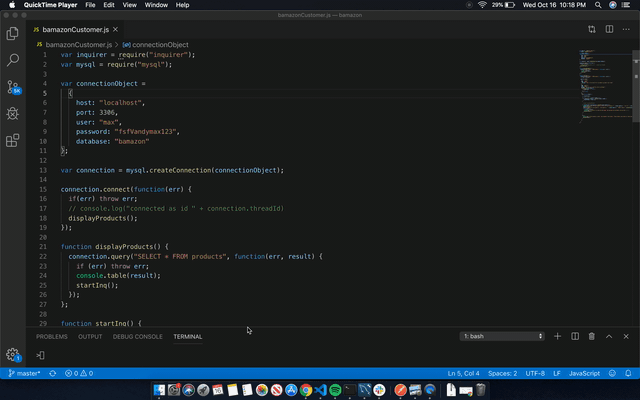

# Bamazon App

This is an application to show the connection between node and MySQL to create an "Amazon" like store front in node. When run, the application shows the user a set of products for the user to "buy". The app either allows the user to buy and decreases the stock of the product or notifies the user that not enough stock is in place & restarts.

## Organization

The app is organized through the main bamazonCustomer.js file. Once node is run, it imports the MySQL data and uses inquirer internally to help move the user along. Some user actions then update the MySQL data.

## How To Use The App

Once downloaded open the terminal for the file and follow along below:
- Run "node bamazon.js" to see a list of current products available (including item ID #, department, price, and stock quantity)
- Follow the inquirer questions to choose a product and quantity you want to purchase
- If enough stock is available, Bamazon will tell you the total price, allow the "sale", and then show you the products again with the decrease in stock from what you've "bought"
- If enough stock is unavailable, the app will let you know and instruct you to choose another product or decrease your quantity before relaunching

## See The App In Action

## Tech Used

- Node.js
- Inquirer
- MySQL

## Fully created by Max Magura, Fall 2019
